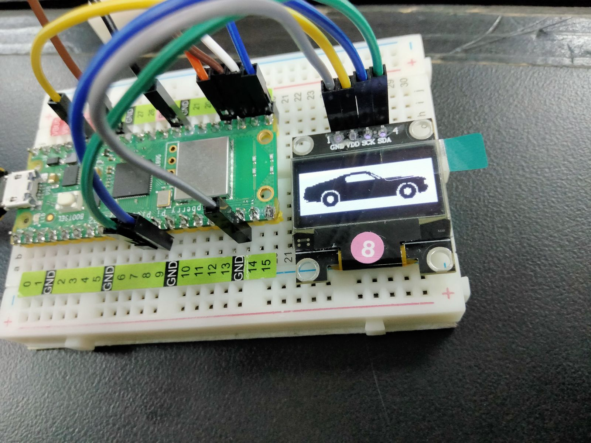

# **Tecnológico Nacional de México**
# **Instituto Tecnológico de Tijuana**
# **Subdirección Académica**
# **Depto de Sistemas y Computación**
# **SEMESTRE: AGOSTO – DICIEMBRE 2023**
# **Ing. En Sistemas Computacionales**
# **SISTEMAS PROGRAMABLES 23a**
# **Estevez Ramirez Maria Teresa - 20211773**
## FECHA: 19 de octubre del 2023

# **MENU DE NAVEGACIÓN**
## Código 
```python
# Alumno: Estevez Ramirez Maria Teresa
# No. control: 20211773

from machine import Pin, I2C
from ssd1306 import SSD1306_I2C
import framebuf, sys
import utime

# Configuración de pines para botones
BUTTON_UP_PIN = machine.Pin(16, machine.Pin.IN, machine.Pin.PULL_UP)
BUTTON_SELECT_PIN = machine.Pin(18, machine.Pin.IN, machine.Pin.PULL_UP)
BUTTON_DOWN_PIN = machine.Pin(17, machine.Pin.IN, machine.Pin.PULL_UP)

# Configuración de la pantalla SSD1306 (128x64)
i2c = machine.I2C(0, sda=machine.Pin(8), scl=machine.Pin(9), freq=400000)
oled = SSD1306_I2C(128, 64, i2c)
oled.init_display()

# Lista de elementos del menú
menu_items = ["3D Cube", "Battery", "Auto"]
selected_item = 0

def display_logo(oled):
    cube3d = bytearray ([0x00, 0x00, 0x00, 0x00, 0xff, 0xff, 0xff, 0xff, 0xff, 0xff, 0xff, 0xff, 0x00, 0x00, 0x00, 0x00, 
0x00, 0x00, 0x00, 0x00, 0xff, 0xff, 0xff, 0xff, 0xff, 0xff, 0xff, 0xff, 0x00, 0x00, 0x00, 0x00, 
0x00, 0x00, 0x00, 0x00, 0xff, 0xff, 0xff, 0xff, 0xff, 0xff, 0xff, 0xff, 0x00, 0x00, 0x00, 0x00, 
0x00, 0x00, 0x00, 0x00, 0xff, 0xff, 0xff, 0xff, 0xff, 0xff, 0xff, 0xff, 0x00, 0x00, 0x00, 0x00, 
0x00, 0x00, 0x00, 0x00, 0xff, 0xff, 0xff, 0xff, 0xff, 0xff, 0xff, 0xff, 0x00, 0x00, 0x00, 0x00, 
0x00, 0x00, 0x00, 0x00, 0xff, 0xff, 0xff, 0xff, 0xff, 0xff, 0xff, 0xff, 0x00, 0x00, 0x00, 0x00, 
0x00, 0x00, 0x00, 0x00, 0xff, 0xff, 0xff, 0xff, 0xff, 0xff, 0xff, 0xff, 0x00, 0x00, 0x00, 0x00, 
0x00, 0x00, 0x00, 0x00, 0xff, 0xff, 0xff, 0xff, 0xff, 0xff, 0xff, 0xff, 0x00, 0x00, 0x00, 0x00, 
0x00, 0x00, 0x00, 0x00, 0xff, 0xff, 0xff, 0xff, 0xff, 0xff, 0xff, 0xff, 0x00, 0x00, 0x00, 0x00, 
0x00, 0x00, 0x00, 0x00, 0xff, 0xff, 0xf8, 0x00, 0x00, 0x00, 0x00, 0x0f, 0x00, 0x00, 0x00, 0x00, 
0x00, 0x00, 0x00, 0x00, 0xff, 0xff, 0xf0, 0x00, 0x00, 0x00, 0x00, 0x0f, 0x00, 0x00, 0x00, 0x00, 
0x00, 0x00, 0x00, 0x00, 0xff, 0xff, 0xc2, 0xff, 0xff, 0xff, 0xfc, 0x0f, 0x00, 0x00, 0x00, 0x00, 
0x00, 0x00, 0x00, 0x00, 0xff, 0xff, 0x0e, 0xff, 0xff, 0xff, 0xe1, 0x4f, 0x00, 0x00, 0x00, 0x00, 
0x00, 0x00, 0x00, 0x00, 0xff, 0xf8, 0x7e, 0xff, 0xff, 0xff, 0x87, 0xcf, 0x00, 0x00, 0x00, 0x00, 
0x00, 0x00, 0x00, 0x00, 0xff, 0xf0, 0xfe, 0xff, 0xff, 0xff, 0x0f, 0xcf, 0x00, 0x00, 0x00, 0x00, 
0x00, 0x00, 0x00, 0x00, 0xff, 0xc3, 0xfe, 0xff, 0xff, 0xf8, 0x3f, 0xcf, 0x00, 0x00, 0x00, 0x00, 
0x00, 0x00, 0x00, 0x00, 0xff, 0x0f, 0xfe, 0xff, 0xff, 0xf0, 0xff, 0xcf, 0x00, 0x00, 0x00, 0x00, 
0x00, 0x00, 0x00, 0x00, 0xf8, 0x7f, 0xfe, 0xff, 0xff, 0x87, 0xff, 0xcf, 0x00, 0x00, 0x00, 0x00, 
0x00, 0x00, 0x00, 0x00, 0xf8, 0x00, 0x00, 0x00, 0x00, 0x0f, 0xff, 0xcf, 0x00, 0x00, 0x00, 0x00, 
0x00, 0x00, 0x00, 0x00, 0xf8, 0x00, 0x00, 0x00, 0x00, 0x3f, 0xff, 0xcf, 0x00, 0x00, 0x00, 0x00, 
0x00, 0x00, 0x00, 0x00, 0xf9, 0xff, 0xfe, 0xff, 0xff, 0xbf, 0xff, 0xcf, 0x00, 0x00, 0x00, 0x00, 
0x00, 0x00, 0x00, 0x00, 0xf9, 0xff, 0xfe, 0xff, 0xff, 0xbf, 0xff, 0xcf, 0x00, 0x00, 0x00, 0x00, 
0x00, 0x00, 0x00, 0x00, 0xf9, 0xff, 0xfe, 0xff, 0xff, 0xbf, 0xff, 0xcf, 0x00, 0x00, 0x00, 0x00, 
0x00, 0x00, 0x00, 0x00, 0xf9, 0xff, 0xfe, 0xff, 0xff, 0xbf, 0xff, 0xcf, 0x00, 0x00, 0x00, 0x00, 
0x00, 0x00, 0x00, 0x00, 0xf9, 0xff, 0xfe, 0xff, 0xff, 0xbf, 0xff, 0xcf, 0x00, 0x00, 0x00, 0x00, 
0x00, 0x00, 0x00, 0x00, 0xf9, 0xff, 0xfe, 0xff, 0xff, 0xbf, 0xff, 0xcf, 0x00, 0x00, 0x00, 0x00, 
0x00, 0x00, 0x00, 0x00, 0xf9, 0xff, 0xfe, 0xff, 0xff, 0xbf, 0xff, 0xcf, 0x00, 0x00, 0x00, 0x00, 
0x00, 0x00, 0x00, 0x00, 0xf9, 0xff, 0xfe, 0xff, 0xff, 0xbf, 0xff, 0xcf, 0x00, 0x00, 0x00, 0x00, 
0x00, 0x00, 0x00, 0x00, 0xf9, 0xff, 0xfe, 0xff, 0xff, 0xbf, 0xff, 0xcf, 0x00, 0x00, 0x00, 0x00, 
0x00, 0x00, 0x00, 0x00, 0xf9, 0xff, 0xfe, 0xff, 0xff, 0xbf, 0xff, 0xcf, 0x00, 0x00, 0x00, 0x00, 
0x00, 0x00, 0x00, 0x00, 0xf9, 0xff, 0xfe, 0xff, 0xff, 0xbf, 0xff, 0xcf, 0x00, 0x00, 0x00, 0x00, 
0x00, 0x00, 0x00, 0x00, 0xf9, 0xff, 0xfe, 0xff, 0xff, 0xbf, 0xff, 0xcf, 0x00, 0x00, 0x00, 0x00, 
0x00, 0x00, 0x00, 0x00, 0xf9, 0xff, 0xfe, 0xff, 0xff, 0xbf, 0xff, 0xcf, 0x00, 0x00, 0x00, 0x00, 
0x00, 0x00, 0x00, 0x00, 0xf9, 0xff, 0xfe, 0xff, 0xff, 0xbf, 0xff, 0xcf, 0x00, 0x00, 0x00, 0x00, 
0x00, 0x00, 0x00, 0x00, 0xf9, 0xff, 0xfe, 0xff, 0xff, 0xbf, 0xff, 0xcf, 0x00, 0x00, 0x00, 0x00, 
0x00, 0x00, 0x00, 0x00, 0xf9, 0xff, 0xfe, 0xff, 0xff, 0xbf, 0xff, 0xcf, 0x00, 0x00, 0x00, 0x00, 
0x00, 0x00, 0x00, 0x00, 0xf9, 0xff, 0xfe, 0xff, 0xff, 0xbf, 0xff, 0xcf, 0x00, 0x00, 0x00, 0x00, 
0x00, 0x00, 0x00, 0x00, 0xf9, 0xff, 0xfe, 0xff, 0xff, 0xbf, 0xff, 0xcf, 0x00, 0x00, 0x00, 0x00, 
0x00, 0x00, 0x00, 0x00, 0xf9, 0xff, 0xfe, 0xff, 0xff, 0xbf, 0xff, 0xcf, 0x00, 0x00, 0x00, 0x00, 
0x00, 0x00, 0x00, 0x00, 0xf9, 0xff, 0xfe, 0xff, 0xff, 0xbf, 0xff, 0xcf, 0x00, 0x00, 0x00, 0x00, 
0x00, 0x00, 0x00, 0x00, 0xf9, 0xff, 0xfe, 0xff, 0xff, 0xbf, 0xff, 0xcf, 0x00, 0x00, 0x00, 0x00, 
0x00, 0x00, 0x00, 0x00, 0xf9, 0xff, 0xfe, 0xff, 0xff, 0xbf, 0xff, 0xcf, 0x00, 0x00, 0x00, 0x00, 
0x00, 0x00, 0x00, 0x00, 0xf9, 0xff, 0xfe, 0xff, 0xff, 0xbf, 0xff, 0xcf, 0x00, 0x00, 0x00, 0x00, 
0x00, 0x00, 0x00, 0x00, 0xf9, 0xff, 0xfe, 0xff, 0xff, 0xbf, 0xff, 0xcf, 0x00, 0x00, 0x00, 0x00, 
0x00, 0x00, 0x00, 0x00, 0xf9, 0xff, 0xfe, 0x00, 0x00, 0x00, 0x00, 0x0f, 0x00, 0x00, 0x00, 0x00, 
0x00, 0x00, 0x00, 0x00, 0xf9, 0xff, 0xf0, 0x00, 0x00, 0x00, 0x00, 0x0f, 0x00, 0x00, 0x00, 0x00, 
0x00, 0x00, 0x00, 0x00, 0xf9, 0xff, 0xe1, 0xff, 0xff, 0xbf, 0xfe, 0x1f, 0x00, 0x00, 0x00, 0x00, 
0x00, 0x00, 0x00, 0x00, 0xf9, 0xff, 0x87, 0xff, 0xff, 0xbf, 0xf8, 0x7f, 0x00, 0x00, 0x00, 0x00, 
0x00, 0x00, 0x00, 0x00, 0xf9, 0xfe, 0x1f, 0xff, 0xff, 0xbf, 0xc3, 0xff, 0x00, 0x00, 0x00, 0x00, 
0x00, 0x00, 0x00, 0x00, 0xf9, 0xf0, 0xff, 0xff, 0xff, 0xbf, 0x0f, 0xff, 0x00, 0x00, 0x00, 0x00, 
0x00, 0x00, 0x00, 0x00, 0xf9, 0xe1, 0xff, 0xff, 0xff, 0xbe, 0x1f, 0xff, 0x00, 0x00, 0x00, 0x00, 
0x00, 0x00, 0x00, 0x00, 0xf9, 0x87, 0xff, 0xff, 0xff, 0xb8, 0x7f, 0xff, 0x00, 0x00, 0x00, 0x00, 
0x00, 0x00, 0x00, 0x00, 0xf8, 0x1f, 0xff, 0xff, 0xff, 0x83, 0xff, 0xff, 0x00, 0x00, 0x00, 0x00, 
0x00, 0x00, 0x00, 0x00, 0xf8, 0x00, 0x00, 0x00, 0x00, 0x07, 0xff, 0xff, 0x00, 0x00, 0x00, 0x00, 
0x00, 0x00, 0x00, 0x00, 0xf8, 0x00, 0x00, 0x00, 0x00, 0x1f, 0xff, 0xff, 0x00, 0x00, 0x00, 0x00, 
0x00, 0x00, 0x00, 0x00, 0xff, 0xff, 0xff, 0xff, 0xff, 0xff, 0xff, 0xff, 0x00, 0x00, 0x00, 0x00, 
0x00, 0x00, 0x00, 0x00, 0xff, 0xff, 0xff, 0xff, 0xff, 0xff, 0xff, 0xff, 0x00, 0x00, 0x00, 0x00, 
0x00, 0x00, 0x00, 0x00, 0xff, 0xff, 0xff, 0xff, 0xff, 0xff, 0xff, 0xff, 0x00, 0x00, 0x00, 0x00, 
0x00, 0x00, 0x00, 0x00, 0xff, 0xff, 0xff, 0xff, 0xff, 0xff, 0xff, 0xff, 0x00, 0x00, 0x00, 0x00, 
0x00, 0x00, 0x00, 0x00, 0xff, 0xff, 0xff, 0xff, 0xff, 0xff, 0xff, 0xff, 0x00, 0x00, 0x00, 0x00, 
0x00, 0x00, 0x00, 0x00, 0xff, 0xff, 0xff, 0xff, 0xff, 0xff, 0xff, 0xff, 0x00, 0x00, 0x00, 0x00, 
0x00, 0x00, 0x00, 0x00, 0xff, 0xff, 0xff, 0xff, 0xff, 0xff, 0xff, 0xff, 0x00, 0x00, 0x00, 0x00, 
0x00, 0x00, 0x00, 0x00, 0xff, 0xff, 0xff, 0xff, 0xff, 0xff, 0xff, 0xff, 0x00, 0x00, 0x00, 0x00, 
0x00, 0x00, 0x00, 0x00, 0xff, 0xff, 0xff, 0xff, 0xff, 0xff, 0xff, 0xff, 0x00, 0x00, 0x00, 0x00])

    battery = bytearray ([0x00, 0x00, 0x00, 0x00, 0x00, 0x00, 0x00, 0x00, 0x00, 0x00, 0x00, 0x00, 0x00, 0x00, 0x00, 0x00, 
0xff, 0xff, 0xff, 0xff, 0xff, 0xff, 0xff, 0xff, 0xff, 0xff, 0xff, 0xff, 0xff, 0xff, 0xff, 0xff, 
0xff, 0xff, 0xff, 0xff, 0xff, 0xff, 0xff, 0xff, 0xff, 0xff, 0xff, 0xff, 0xff, 0xff, 0xff, 0xff, 
0xff, 0xff, 0xff, 0xff, 0xff, 0xff, 0xff, 0xff, 0xff, 0xff, 0xff, 0xff, 0xff, 0xff, 0xff, 0xff, 
0xff, 0xff, 0xff, 0xff, 0xff, 0xff, 0xff, 0xff, 0xff, 0xff, 0xff, 0xff, 0xff, 0xff, 0xff, 0xff, 
0xff, 0xff, 0xff, 0xff, 0xff, 0xff, 0xff, 0xff, 0xff, 0xff, 0xff, 0xff, 0xff, 0xff, 0xff, 0xff, 
0xff, 0xff, 0xff, 0xff, 0xff, 0xff, 0xff, 0xff, 0xff, 0xff, 0xff, 0xff, 0xff, 0xff, 0xff, 0xff, 
0xff, 0x80, 0x00, 0x00, 0x00, 0x00, 0x00, 0x00, 0x00, 0x00, 0x00, 0x00, 0x00, 0xff, 0xff, 0xff, 
0xfe, 0x00, 0x00, 0x00, 0x00, 0x00, 0x00, 0x00, 0x00, 0x00, 0x00, 0x00, 0x00, 0x3f, 0xff, 0xff, 
0xfc, 0x00, 0x00, 0x00, 0x00, 0x00, 0x00, 0x00, 0x00, 0x00, 0x00, 0x00, 0x00, 0x1f, 0xff, 0xff, 
0xf8, 0x00, 0x00, 0x00, 0x00, 0x00, 0x00, 0x00, 0x00, 0x00, 0x00, 0x00, 0x00, 0x07, 0xff, 0xff, 
0xf0, 0x00, 0x00, 0x00, 0x00, 0x00, 0x00, 0x00, 0x00, 0x00, 0x00, 0x00, 0x00, 0x07, 0xff, 0xff, 
0xe0, 0x1f, 0xff, 0xff, 0xff, 0xff, 0xff, 0xff, 0xff, 0xff, 0xff, 0xff, 0xfc, 0x03, 0xff, 0xff, 
0xe0, 0x7f, 0xff, 0xff, 0xff, 0xff, 0xff, 0xff, 0xff, 0xff, 0xff, 0xff, 0xff, 0x03, 0xff, 0xff, 
0xe0, 0xff, 0xff, 0xff, 0xff, 0xff, 0xff, 0xff, 0xff, 0xff, 0xff, 0xff, 0xff, 0x83, 0xff, 0xff, 
0xc0, 0xff, 0xff, 0xff, 0xff, 0xff, 0xff, 0xff, 0xff, 0xff, 0xff, 0xff, 0xff, 0x81, 0xff, 0xff, 
0xc0, 0xf0, 0x00, 0x00, 0x01, 0xff, 0xff, 0xff, 0xff, 0xff, 0xff, 0xff, 0xff, 0xc1, 0xff, 0xff, 
0xc0, 0xe0, 0x00, 0x00, 0x01, 0xff, 0xff, 0xff, 0xff, 0xff, 0xff, 0xff, 0xff, 0xc1, 0xff, 0xff, 
0xc0, 0xe0, 0x00, 0x00, 0x01, 0xff, 0xff, 0xff, 0xff, 0xff, 0xff, 0xff, 0xff, 0xc1, 0xff, 0xff, 
0xc0, 0xe0, 0x00, 0x00, 0x01, 0xff, 0xff, 0xff, 0xff, 0xff, 0xff, 0xff, 0xff, 0xc1, 0xff, 0xff, 
0xc0, 0xe0, 0x00, 0x00, 0x01, 0xff, 0xff, 0xff, 0xff, 0xff, 0xff, 0xff, 0xff, 0xc1, 0xff, 0xff, 
0xc0, 0xe0, 0x00, 0x00, 0x01, 0xff, 0xff, 0xff, 0xff, 0xff, 0xff, 0xff, 0xff, 0xc0, 0x03, 0xff, 
0xc0, 0xe0, 0x00, 0x00, 0x01, 0xff, 0xff, 0xff, 0xff, 0xff, 0xff, 0xff, 0xff, 0xc0, 0x01, 0xff, 
0xc0, 0xe0, 0x00, 0x00, 0x01, 0xff, 0xff, 0xff, 0xff, 0xff, 0xff, 0xff, 0xff, 0xc0, 0x01, 0xff, 
0xc0, 0xe0, 0x00, 0x00, 0x01, 0xff, 0xff, 0xff, 0xff, 0xff, 0xff, 0xff, 0xff, 0xc0, 0x00, 0xff, 
0xc0, 0xe0, 0x00, 0x00, 0x01, 0x80, 0xc7, 0xdf, 0xff, 0xff, 0xff, 0xff, 0xff, 0xc0, 0x00, 0xff, 
0xc0, 0xe0, 0x00, 0x00, 0x71, 0x00, 0x83, 0x9f, 0xff, 0xff, 0xff, 0xff, 0xff, 0xc0, 0x00, 0xff, 
0xc0, 0xe0, 0x00, 0x00, 0x71, 0x00, 0x81, 0x9f, 0xff, 0xff, 0xff, 0xff, 0xff, 0xc0, 0x00, 0xff, 
0xc0, 0xe0, 0x00, 0x00, 0xf1, 0x1f, 0x91, 0x1f, 0xff, 0xff, 0xff, 0xff, 0xff, 0xc0, 0x00, 0xff, 
0xc0, 0xe0, 0x00, 0x01, 0xf1, 0x03, 0x91, 0x3f, 0xff, 0xff, 0xff, 0xff, 0xff, 0xc0, 0x00, 0xff, 
0xc0, 0xe0, 0x00, 0x01, 0x70, 0x01, 0x81, 0x3f, 0xff, 0xff, 0xff, 0xff, 0xff, 0xc0, 0x00, 0xff, 
0xc0, 0xe0, 0x00, 0x03, 0x30, 0x00, 0x82, 0x7f, 0xff, 0xff, 0xff, 0xff, 0xff, 0xc0, 0x00, 0xff, 
0xc0, 0xe0, 0x00, 0x06, 0x30, 0x30, 0xc6, 0x47, 0xff, 0xff, 0xff, 0xff, 0xff, 0xc0, 0x00, 0xff, 
0xc0, 0xe0, 0x00, 0x06, 0x31, 0xf8, 0xfc, 0x03, 0xff, 0xff, 0xff, 0xff, 0xff, 0xc0, 0x00, 0xff, 
0xc0, 0xe0, 0x00, 0x0f, 0xf8, 0x38, 0xfc, 0x83, 0xff, 0xff, 0xff, 0xff, 0xff, 0xc0, 0x00, 0xff, 
0xc0, 0xe0, 0x00, 0x0f, 0xf8, 0x38, 0xf8, 0x93, 0xff, 0xff, 0xff, 0xff, 0xff, 0xc0, 0x00, 0xff, 
0xc0, 0xe0, 0x00, 0x00, 0x78, 0x00, 0xf9, 0x91, 0xff, 0xff, 0xff, 0xff, 0xff, 0xc0, 0x00, 0xff, 
0xc0, 0xe0, 0x00, 0x00, 0x31, 0x01, 0xf9, 0x93, 0xff, 0xff, 0xff, 0xff, 0xff, 0xc0, 0x00, 0xff, 
0xc0, 0xe0, 0x00, 0x00, 0x31, 0x83, 0xf3, 0x83, 0xff, 0xff, 0xff, 0xff, 0xff, 0xc0, 0x00, 0xff, 
0xc0, 0xe0, 0x00, 0x00, 0x01, 0xff, 0xf3, 0xc7, 0xff, 0xff, 0xff, 0xff, 0xff, 0xc0, 0x00, 0xff, 
0xc0, 0xe0, 0x00, 0x00, 0x01, 0xff, 0xff, 0xff, 0xff, 0xff, 0xff, 0xff, 0xff, 0xc0, 0x01, 0xff, 
0xc0, 0xe0, 0x00, 0x00, 0x01, 0xff, 0xff, 0xff, 0xff, 0xff, 0xff, 0xff, 0xff, 0xc0, 0x01, 0xff, 
0xc0, 0xe0, 0x00, 0x00, 0x01, 0xff, 0xff, 0xff, 0xff, 0xff, 0xff, 0xff, 0xff, 0xc0, 0x03, 0xff, 
0xc0, 0xe0, 0x00, 0x00, 0x01, 0xff, 0xff, 0xff, 0xff, 0xff, 0xff, 0xff, 0xff, 0xc0, 0x0f, 0xff, 
0xc0, 0xe0, 0x00, 0x00, 0x01, 0xff, 0xff, 0xff, 0xff, 0xff, 0xff, 0xff, 0xff, 0xc1, 0xff, 0xff, 
0xc0, 0xe0, 0x00, 0x00, 0x01, 0xff, 0xff, 0xff, 0xff, 0xff, 0xff, 0xff, 0xff, 0xc1, 0xff, 0xff, 
0xc0, 0xe0, 0x00, 0x00, 0x01, 0xff, 0xff, 0xff, 0xff, 0xff, 0xff, 0xff, 0xff, 0xc1, 0xff, 0xff, 
0xc0, 0xe0, 0x00, 0x00, 0x01, 0xff, 0xff, 0xff, 0xff, 0xff, 0xff, 0xff, 0xff, 0xc1, 0xff, 0xff, 
0xc0, 0xff, 0xff, 0xff, 0xff, 0xff, 0xff, 0xff, 0xff, 0xff, 0xff, 0xff, 0xff, 0xc1, 0xff, 0xff, 
0xe0, 0xff, 0xff, 0xff, 0xff, 0xff, 0xff, 0xff, 0xff, 0xff, 0xff, 0xff, 0xff, 0x81, 0xff, 0xff, 
0xe0, 0x7f, 0xff, 0xff, 0xff, 0xff, 0xff, 0xff, 0xff, 0xff, 0xff, 0xff, 0xff, 0x83, 0xff, 0xff, 
0xe0, 0x3f, 0xff, 0xff, 0xff, 0xff, 0xff, 0xff, 0xff, 0xff, 0xff, 0xff, 0xfe, 0x03, 0xff, 0xff, 
0xf0, 0x00, 0x00, 0x00, 0x00, 0x00, 0x00, 0x00, 0x00, 0x00, 0x00, 0x00, 0x00, 0x03, 0xff, 0xff, 
0xf0, 0x00, 0x00, 0x00, 0x00, 0x00, 0x00, 0x00, 0x00, 0x00, 0x00, 0x00, 0x00, 0x07, 0xff, 0xff, 
0xf8, 0x00, 0x00, 0x00, 0x00, 0x00, 0x00, 0x00, 0x00, 0x00, 0x00, 0x00, 0x00, 0x0f, 0xff, 0xff, 
0xfc, 0x00, 0x00, 0x00, 0x00, 0x00, 0x00, 0x00, 0x00, 0x00, 0x00, 0x00, 0x00, 0x1f, 0xff, 0xff, 
0xff, 0x80, 0x00, 0x00, 0x00, 0x00, 0x00, 0x00, 0x00, 0x00, 0x00, 0x00, 0x00, 0x7f, 0xff, 0xff, 
0xff, 0xff, 0xff, 0xff, 0xff, 0xff, 0xff, 0xff, 0xff, 0xff, 0xff, 0xff, 0xff, 0xff, 0xff, 0xff, 
0xff, 0xff, 0xff, 0xff, 0xff, 0xff, 0xff, 0xff, 0xff, 0xff, 0xff, 0xff, 0xff, 0xff, 0xff, 0xff, 
0xff, 0xff, 0xff, 0xff, 0xff, 0xff, 0xff, 0xff, 0xff, 0xff, 0xff, 0xff, 0xff, 0xff, 0xff, 0xff, 
0xff, 0xff, 0xff, 0xff, 0xff, 0xff, 0xff, 0xff, 0xff, 0xff, 0xff, 0xff, 0xff, 0xff, 0xff, 0xff, 
0xff, 0xff, 0xff, 0xff, 0xff, 0xff, 0xff, 0xff, 0xff, 0xff, 0xff, 0xff, 0xff, 0xff, 0xff, 0xff, 
0xff, 0xff, 0xff, 0xff, 0xff, 0xff, 0xff, 0xff, 0xff, 0xff, 0xff, 0xff, 0xff, 0xff, 0xff, 0xff, 
0x00, 0x00, 0x00, 0x00, 0x00, 0x00, 0x00, 0x00, 0x00, 0x00, 0x00, 0x00, 0x00, 0x00, 0x00, 0x00])

    auto = bytearray ([0x00, 0x00, 0x00, 0x00, 0x00, 0x00, 0x00, 0x00, 0x00, 0x00, 0x00, 0x00, 0x00, 0x00, 0x00, 0x00, 
0x00, 0x00, 0x00, 0x00, 0x00, 0x00, 0x00, 0x00, 0x00, 0x00, 0x00, 0x00, 0x00, 0x00, 0x00, 0x00, 
0x00, 0x00, 0x00, 0x00, 0x00, 0x00, 0x00, 0x00, 0x00, 0x00, 0x00, 0x00, 0x00, 0x00, 0x00, 0x00, 
0x00, 0x00, 0x00, 0x00, 0x00, 0x00, 0x00, 0x00, 0x00, 0x00, 0x00, 0x00, 0x00, 0x00, 0x00, 0x00, 
0x00, 0x00, 0x00, 0x00, 0x00, 0x00, 0x00, 0x00, 0x00, 0x00, 0x00, 0x00, 0x00, 0x00, 0x00, 0x00, 
0x00, 0x00, 0x00, 0x00, 0x00, 0x00, 0x00, 0x00, 0x00, 0x00, 0x00, 0x00, 0x00, 0x00, 0x00, 0x00, 
0x00, 0x00, 0x00, 0x00, 0x00, 0x00, 0x00, 0x00, 0x00, 0x00, 0x00, 0x00, 0x00, 0x00, 0x00, 0x00, 
0x00, 0x00, 0x00, 0x00, 0x00, 0x00, 0x00, 0x00, 0x00, 0x00, 0x00, 0x00, 0x00, 0x00, 0x00, 0x00, 
0x00, 0x00, 0x00, 0x00, 0x00, 0x00, 0x00, 0x00, 0x00, 0x00, 0x00, 0x00, 0x00, 0x00, 0x00, 0x00, 
0x00, 0x00, 0x00, 0x00, 0x00, 0x00, 0x00, 0x00, 0x00, 0x00, 0x00, 0x00, 0x00, 0x00, 0x00, 0x00, 
0xff, 0xff, 0xff, 0xff, 0xff, 0xff, 0xff, 0xff, 0xff, 0xff, 0xff, 0xff, 0xff, 0xff, 0xff, 0xff, 
0xff, 0xff, 0xff, 0xff, 0xff, 0xff, 0xff, 0xff, 0xff, 0xff, 0xff, 0xff, 0xff, 0xff, 0xff, 0xff, 
0xff, 0xff, 0xff, 0xff, 0xff, 0xff, 0xff, 0xff, 0xff, 0xff, 0xff, 0xff, 0xff, 0xff, 0xff, 0xff, 
0xff, 0xff, 0xff, 0xff, 0xff, 0xff, 0xff, 0xff, 0xff, 0xff, 0xff, 0xff, 0xff, 0xff, 0xff, 0xff, 
0xff, 0xff, 0xff, 0xff, 0xff, 0xff, 0xff, 0xff, 0xff, 0xff, 0xff, 0xff, 0xff, 0xff, 0xff, 0xff, 
0xff, 0xff, 0xff, 0xff, 0xff, 0xff, 0xe0, 0x00, 0x1f, 0xff, 0xff, 0xff, 0xff, 0xff, 0xff, 0xff, 
0xff, 0xff, 0xff, 0xff, 0xff, 0xf0, 0x00, 0x00, 0x03, 0xff, 0xff, 0xff, 0xff, 0xff, 0xff, 0xff, 
0xff, 0xff, 0xff, 0xff, 0xff, 0x00, 0x00, 0x00, 0x01, 0xff, 0xff, 0xff, 0xff, 0xff, 0xff, 0xff, 
0xff, 0xff, 0xff, 0xff, 0xfc, 0x00, 0x1f, 0xff, 0xc0, 0x7f, 0xff, 0xff, 0xff, 0xff, 0xff, 0xff, 
0xff, 0xff, 0xff, 0xff, 0xc0, 0x01, 0xff, 0xff, 0xf1, 0x3f, 0xff, 0xff, 0xff, 0xff, 0xff, 0xff, 
0xff, 0xff, 0xff, 0xfc, 0x00, 0x03, 0xff, 0xff, 0xf8, 0x9f, 0xff, 0xff, 0xff, 0xff, 0xff, 0xff, 
0xff, 0xff, 0xff, 0x80, 0x00, 0x03, 0xff, 0xff, 0xfe, 0x67, 0xff, 0xff, 0xff, 0xff, 0xff, 0xff, 
0xff, 0xff, 0xe0, 0x00, 0x00, 0x03, 0xff, 0xff, 0xff, 0x13, 0xff, 0xff, 0xff, 0xff, 0xff, 0xff, 
0xff, 0xff, 0x00, 0x00, 0x00, 0x01, 0xff, 0xff, 0xff, 0x8c, 0xff, 0xff, 0xff, 0xff, 0xff, 0xff, 
0xff, 0xf8, 0x00, 0x00, 0x00, 0x01, 0xff, 0xff, 0xff, 0xc6, 0x7f, 0xff, 0xff, 0xff, 0xff, 0xff, 
0xfe, 0x00, 0x00, 0x00, 0x00, 0x00, 0x00, 0x00, 0x00, 0x00, 0x00, 0x00, 0x1f, 0xff, 0xff, 0xff, 
0xfc, 0x00, 0x00, 0x00, 0x00, 0x00, 0x00, 0x00, 0x00, 0x00, 0x00, 0x00, 0x00, 0x03, 0xff, 0xff, 
0xf8, 0x00, 0x00, 0x00, 0x00, 0x00, 0x00, 0x00, 0x00, 0x00, 0x00, 0x00, 0x00, 0x00, 0x1f, 0xff, 
0xf8, 0x00, 0x00, 0x00, 0x00, 0x00, 0x00, 0x00, 0x00, 0x00, 0x00, 0x00, 0x00, 0x00, 0x03, 0xff, 
0xf8, 0x00, 0x00, 0x00, 0x00, 0x00, 0x00, 0x00, 0x00, 0x00, 0x00, 0x00, 0x00, 0x00, 0x00, 0xff, 
0xf8, 0x00, 0x00, 0x00, 0x00, 0x00, 0x00, 0x00, 0x00, 0x00, 0x00, 0x00, 0x00, 0x00, 0x00, 0x7f, 
0xf0, 0x00, 0x00, 0x00, 0x00, 0x00, 0x00, 0x00, 0x00, 0x00, 0x00, 0x00, 0x00, 0x00, 0x00, 0x7f, 
0xf0, 0x00, 0x00, 0x7f, 0xc0, 0x00, 0x00, 0x00, 0x00, 0x00, 0x00, 0x00, 0x00, 0x00, 0x01, 0xff, 
0xf0, 0x00, 0x00, 0xe0, 0x70, 0x00, 0x00, 0x00, 0x00, 0x00, 0x00, 0x00, 0x1c, 0xe0, 0x01, 0xff, 
0xf0, 0x00, 0x01, 0x80, 0x18, 0x00, 0x00, 0x00, 0x00, 0x00, 0x00, 0x00, 0x60, 0x18, 0x01, 0xff, 
0xe0, 0x00, 0x03, 0x00, 0x0c, 0x00, 0x00, 0x00, 0x00, 0x00, 0x00, 0x00, 0xc0, 0x0c, 0x01, 0xff, 
0xe0, 0x00, 0x02, 0x00, 0x04, 0x00, 0x00, 0x00, 0x00, 0x00, 0x00, 0x01, 0x80, 0x06, 0x00, 0x7f, 
0xf0, 0x00, 0x02, 0x00, 0x02, 0x00, 0x00, 0x00, 0x00, 0x00, 0x00, 0x01, 0x00, 0x02, 0x00, 0x3f, 
0xf0, 0x00, 0x04, 0x0f, 0x02, 0x00, 0x00, 0x00, 0x00, 0x00, 0x00, 0x03, 0x03, 0x03, 0x00, 0x3f, 
0xfc, 0x00, 0x04, 0x1f, 0x82, 0x00, 0x00, 0x00, 0x00, 0x00, 0x00, 0x02, 0x0f, 0xc1, 0x00, 0x3f, 
0xff, 0x00, 0x04, 0x1f, 0x82, 0x00, 0x00, 0x00, 0x00, 0x00, 0x00, 0x06, 0x0f, 0xc1, 0x00, 0x7f, 
0xfc, 0x00, 0x04, 0x1f, 0x82, 0x00, 0x00, 0x00, 0x00, 0x00, 0x00, 0x06, 0x0f, 0xc1, 0x00, 0x7f, 
0xff, 0xff, 0x04, 0x1f, 0x82, 0x00, 0x00, 0x00, 0x00, 0x00, 0x00, 0x06, 0x0f, 0xc1, 0x00, 0xff, 
0xff, 0xff, 0xfc, 0x0f, 0x02, 0x00, 0x00, 0x00, 0x00, 0x00, 0x00, 0x06, 0x0f, 0x81, 0x01, 0xff, 
0xff, 0xff, 0xfe, 0x06, 0x02, 0x00, 0x00, 0x00, 0x00, 0x00, 0x00, 0x07, 0x03, 0x03, 0x9f, 0xff, 
0xff, 0xff, 0xfe, 0x00, 0x07, 0xff, 0xff, 0xff, 0xff, 0xff, 0xff, 0xff, 0x00, 0x03, 0xff, 0xff, 
0xff, 0xff, 0xff, 0x00, 0x0f, 0xff, 0xff, 0xff, 0xff, 0xff, 0xff, 0xff, 0x80, 0x07, 0xff, 0xff, 
0xff, 0xff, 0xff, 0x80, 0x1f, 0xff, 0xff, 0xff, 0xff, 0xff, 0xff, 0xff, 0xc0, 0x0f, 0xff, 0xff, 
0xff, 0xff, 0xff, 0xc0, 0x3f, 0xff, 0xff, 0xff, 0xff, 0xff, 0xff, 0xff, 0xe0, 0x1f, 0xff, 0xff, 
0xff, 0xff, 0xff, 0xff, 0xff, 0xff, 0xff, 0xff, 0xff, 0xff, 0xff, 0xff, 0xff, 0xff, 0xff, 0xff, 
0xff, 0xff, 0xff, 0xff, 0xff, 0xff, 0xff, 0xff, 0xff, 0xff, 0xff, 0xff, 0xff, 0xff, 0xff, 0xff, 
0xff, 0xff, 0xff, 0xff, 0xff, 0xff, 0xff, 0xff, 0xff, 0xff, 0xff, 0xff, 0xff, 0xff, 0xff, 0xff, 
0xff, 0xff, 0xff, 0xff, 0xff, 0xff, 0xff, 0xff, 0xff, 0xff, 0xff, 0xff, 0xff, 0xff, 0xff, 0xff, 
0xff, 0xff, 0xff, 0xff, 0xff, 0xff, 0xff, 0xff, 0xff, 0xff, 0xff, 0xff, 0xff, 0xff, 0xff, 0xff, 
0xff, 0xff, 0xff, 0xff, 0xff, 0xff, 0xff, 0xff, 0xff, 0xff, 0xff, 0xff, 0xff, 0xff, 0xff, 0xff, 
0x00, 0x00, 0x00, 0x00, 0x00, 0x00, 0x00, 0x00, 0x00, 0x00, 0x00, 0x00, 0x00, 0x00, 0x00, 0x00, 
0x00, 0x00, 0x00, 0x00, 0x00, 0x00, 0x00, 0x00, 0x00, 0x00, 0x00, 0x00, 0x00, 0x00, 0x00, 0x00, 
0x00, 0x00, 0x00, 0x00, 0x00, 0x00, 0x00, 0x00, 0x00, 0x00, 0x00, 0x00, 0x00, 0x00, 0x00, 0x00, 
0x00, 0x00, 0x00, 0x00, 0x00, 0x00, 0x00, 0x00, 0x00, 0x00, 0x00, 0x00, 0x00, 0x00, 0x00, 0x00, 
0x00, 0x00, 0x00, 0x00, 0x00, 0x00, 0x00, 0x00, 0x00, 0x00, 0x00, 0x00, 0x00, 0x00, 0x00, 0x00, 
0x00, 0x00, 0x00, 0x00, 0x00, 0x00, 0x00, 0x00, 0x00, 0x00, 0x00, 0x00, 0x00, 0x00, 0x00, 0x00, 
0x00, 0x00, 0x00, 0x00, 0x00, 0x00, 0x00, 0x00, 0x00, 0x00, 0x00, 0x00, 0x00, 0x00, 0x00, 0x00, 
0x00, 0x00, 0x00, 0x00, 0x00, 0x00, 0x00, 0x00, 0x00, 0x00, 0x00, 0x00, 0x00, 0x00, 0x00, 0x00, 
0x00, 0x00, 0x00, 0x00, 0x00, 0x00, 0x00, 0x00, 0x00, 0x00, 0x00, 0x00, 0x00, 0x00, 0x00, 0x00])
    
    while True:
        oled.fill(0)
        oled.show() 
        utime.sleep(0.2)
        if selected_item == 0:
            fb = framebuf.FrameBuffer(bytearray(cube3d), 128, 64, framebuf.MONO_HLSB)
            oled.fill(0)
            oled.blit(fb, 0, 0)
            oled.show()
            utime.sleep(2)
            return main()
        elif selected_item == 1:
            fb = framebuf.FrameBuffer(bytearray(battery), 128, 64, framebuf.MONO_HLSB)
            oled.fill(0)
            oled.blit(fb, 0, 0)
            oled.show()
            utime.sleep(2)
            return main()
        elif selected_item == 2:
            fb = framebuf.FrameBuffer(bytearray(auto), 128, 64, framebuf.MONO_HLSB)
            oled.fill(0)
            oled.blit(fb, 0, 0)
            oled.show()
            utime.sleep(2)
            return main()
                
# Función para dibujar el menú en la pantalla OLED
def draw_menu():
    oled.fill(0)
    for i, item in enumerate(menu_items):
        if i == selected_item:
            oled.text(">", 0, i * 10)
        oled.text(item, 10, i * 10)
    oled.show()

# Función para navegar por el menú
def navigate_menu(direction):
    global selected_item
    if direction == "up":
        selected_item -= 1
        if selected_item < 0:
            selected_item = len(menu_items) - 1
    elif direction == "down":
        selected_item += 1
        if selected_item >= len(menu_items):
            selected_item = 0

# Función principal
def main():
    draw_menu()
    
    while True:
        if BUTTON_UP_PIN.value() == 0:
            navigate_menu("up")
            draw_menu()
            while BUTTON_UP_PIN.value() == 0:
                pass  # Espera a que se suelte el botón
        elif BUTTON_DOWN_PIN.value() == 0:
            navigate_menu("down")
            draw_menu()
            while BUTTON_DOWN_PIN.value() == 0:
                pass  # Espera a que se suelte el botón
        elif BUTTON_SELECT_PIN.value() == 0:
            # Acción cuando se selecciona un elemento del menú
            oled.fill(0)
            oled.text("Seleccionado:", 0, 0)
            oled.text(menu_items[selected_item], 0, 20)
            oled.show()
            utime.sleep(2)
            display_logo(oled)
            while BUTTON_SELECT_PIN.value() == 0:
                pass  # Espera a que se suelte el botón

if __name__ == "__main__":
    main()
```
## Simulación del circuito


## Curcuito

> Menú


> Opción 1


> Opción 2



> Opción 3
